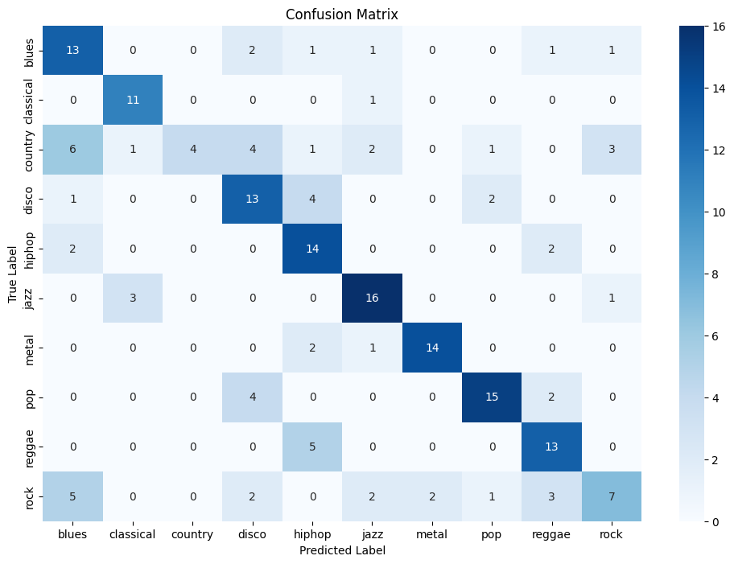

# Music-Genres-Classifier-On-GTZAN

This repository contains a music genre classification project using the GTZAN dataset. The goal of this project is to build a machine learning model that can accurately classify music tracks into their respective genres.

## Table of Contents
- [Introduction](#introduction)
- [Dataset](#dataset)
- [Results](#results)

## Introduction
Music genre classification is a popular application of machine learning and audio signal processing. This project uses the GTZAN dataset, which is a well-known dataset in the music information retrieval community, to train and evaluate a classifier that can predict the genre of a music track.

## Dataset
The GTZAN dataset consists of 1000 audio tracks categorized into 10 genres: blues, classical, country, disco, hiphop, jazz, metal, pop, reggae, and rock. Each genre contains 100 tracks, each 30 seconds long. The dataset can be downloaded from [here](https://www.kaggle.com/datasets/carlthome/gtzan-genre-collection/).

## Results
The reuslt on test data is about 63.5%. which is acceptable considering genres like Rock, which has lots of variant subgenres that are similar to other genres.
Here is an image of the confusion matrix:

